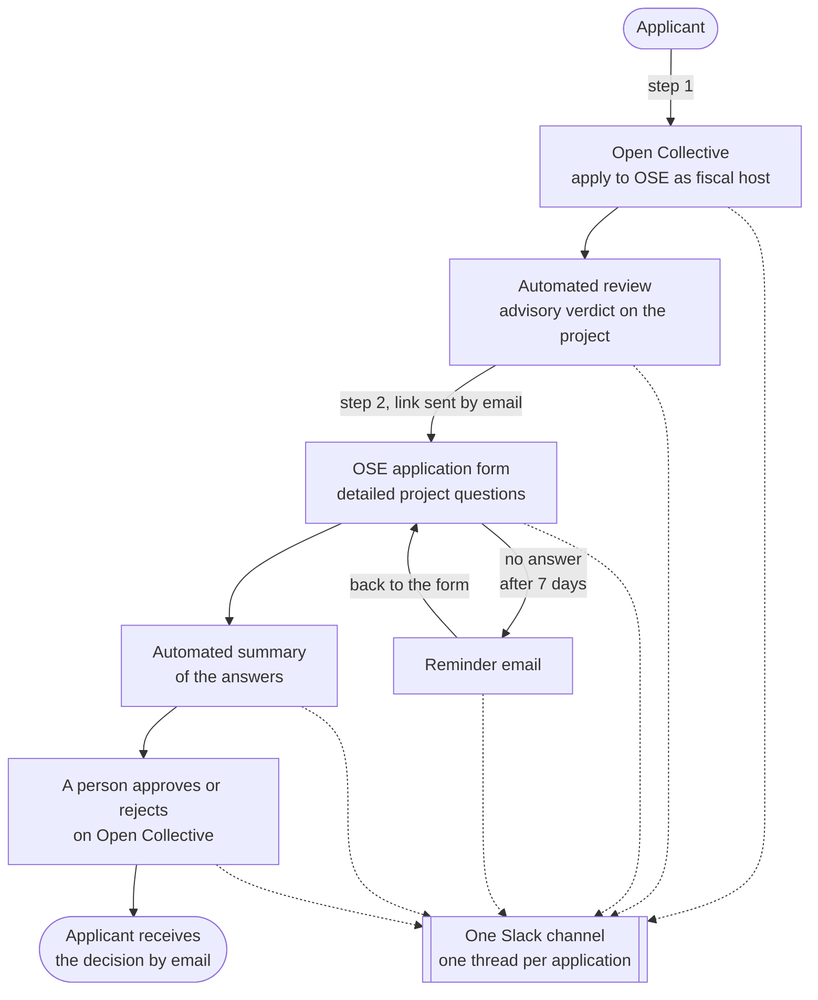

All things community for [Open Source Europe (OSE)](https://opensourceeurope.org/).

## About

Open Source Europe is a European nonprofit that gives open source projects a shared fiscal and legal home. Instead of every project setting up its own legal entity, OSE provides a common nonprofit structure so maintainers can receive donations, manage expenses, and operate transparently — while staying fully autonomous.

This repository is the home for community-related discussions, governance, processes, and shared resources for projects under the OSE umbrella.

## How an application works

An application passes through two forms. Open Collective hosts the first one,
Open Source Europe hosts the second, and the steps in between are automated.

The following diagram shows the whole process and what each system does in it:

An application starts and ends on Open Collective. Open Collective calls OSE a
fiscal host, and a collective applies to a host from that host's page. Later, a
person approves or rejects that same application in the same place. Open
Collective holds the decision, and no automated step makes it, per the
[AI policy](https://github.com/opensourceeurope/.github/blob/main/AI-POLICY.md).

The OSE application form is step 2. An application on Open Collective carries a
description and a short message. The form collects the detail OSE needs on top
of that:

- what the project does, and where its work happens in the open
- which licence it uses
- whether it is already a legal entity
- what it expects to raise and to spend

The link to the form arrives by email after step 1. An applicant who has not
applied on Open Collective cannot get past the first page of the form.

The automation connects the two forms. It picks up each new application and
emails the invitation to the form. After 7 days of silence it sends one
reminder. After 7 more days it asks in the Slack thread for a person to pick the
application up.

A model hosted in the EU reads each application twice, and each read returns a
verdict rather than a description. The first one reads the public project
material and gives a verdict with its reasoning. The four verdicts are: the
project fits, it belongs with another host, it is not open source, or the
evidence is unclear. That verdict picks which invitation email the applicant
receives, and the review itself goes into the Slack thread. The second read runs
after a submission. It reads the answers and the project's README, then posts
one paragraph and a verdict of its own.

Both reads are advisory. Neither one recommends an approval or a rejection, and
a person makes the decision on Open Collective. The workflows run on
[n8n](https://n8n.io), self-hosted on a European virtual server.

Every update about every application appears in one Slack channel. The first
message about an application starts a thread. Every later step replies in that
thread: the review, the invitation, the reminder, the answers, the
summary, and the decision. Reactions on the first message show the current
stage. To follow one application, read its thread. To see all of them, read the
channel.

[`automation/`](automation/) holds the workflows that run this, the email
templates they send, and the operator runbook.

## License

This repository carries two licences:

- Everything **except** `automation/` — governance, process, and other
  content — is licensed under [CC-BY-4.0](LICENSE).
- Everything under [`automation/`](automation/) is software and is licensed
  under the [MIT License](automation/LICENSE).

Contributions are accepted under the licence covering the path they touch.
