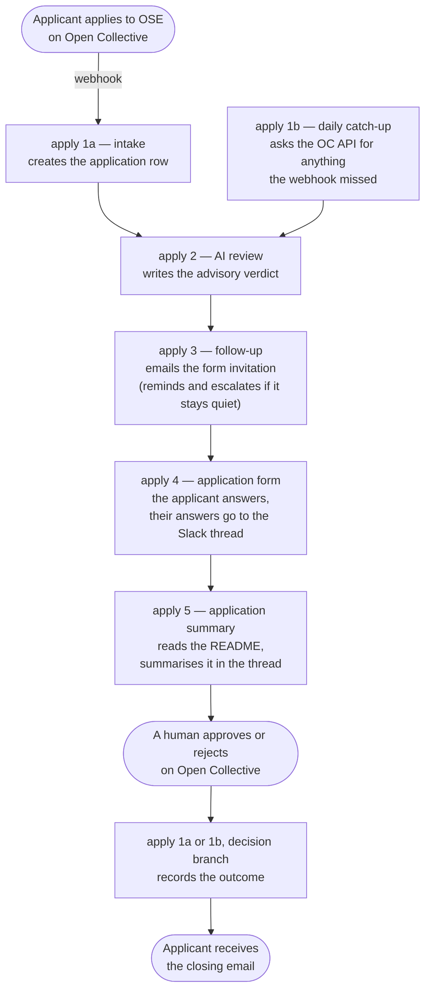

# Automation

Software that automates OSE community operations, starting with the new
collective application process.

Everything under `automation/` is licensed under the [MIT License](LICENSE).
The rest of this repository is covered by CC-BY-4.0.

## Human decisions

The AI review is advisory. It never approves, rejects or closes an
application. Approve and reject happen on Open Collective, by a person, and
the automation only listens for the result. The org
[AI policy](https://github.com/opensourceeurope/.github/blob/main/AI-POLICY.md)
lists "casting governance votes or approvals" as human-only.

Only public project material is sent to the model: the collective's
description, the application message, and the linked repository and website.
The applicant's name and email address are never sent.

## Running it

The deployment lives on one VPS: n8n on Postgres behind Caddy.
[`infra/README.md`](infra/README.md) is the operator runbook. It covers
installation from a fresh box, SSH recovery, backups, restore, upgrades, and
a troubleshooting table of failures already hit in practice.

## The workflows

`automation/n8n/` holds the export of every workflow. Five workflows
coordinate through one Data table (`ose_applications`, keyed by collective
slug) and never call each other. Each workflow sends its own emails and Slack
messages, and every send site checks `DRY_RUN` first.

The automation serves Open Source Europe only. Open Collective Europe appears
in one place: the AI review may suggest that a project fits OCE better.

On the instance the workflows are named `apply <step>` plus a description, so
the workflow list reads in pipeline order. The export files use short names.

| Workflow on the instance | Export | Trigger | What it does |
|---|---|---|---|
| `apply 1a — intake` | `oc-events-intake.json` | `POST /webhook/oc-events` | Treats every OC webhook as a ping, because the payload carries no application data. A new application gets a row. An approve or reject decision gets recorded, and the applicant gets the closing email. |
| `apply 1b — daily catch-up` | `intake-sweep.json` | `SWEEP_CRON` | Fetches applications and decisions the webhook missed. |
| `apply 2 — AI review` | `review.json` | `SWEEP_CRON` | Writes an advisory verdict on every row at stage `applied`. |
| `apply 3 — follow-up` | `followup.json` | `SWEEP_CRON` | Sends the form invitation for every reviewed row. The verdict picks the email. Also sends the one reminder and the Slack escalation, both derived from timestamps. |
| `apply 4 — application form` | `form-ose.json` | `/form/apply-ose` | The step 2 form. Page 1 checks the state table, answers persist after every page, and a submission puts the applicant's answers in the application's Slack thread. |
| `apply 5 — application summary` | `summary.json` | `SUMMARY_CRON` | Reads a submitted form and the project's README, then posts a description and the gaps a reviewer should ask about into the thread. Advisory, like the review: it never recommends a decision. |

One application flows through the workflows in this order:



`apply 1b — daily catch-up` exists because Open Collective delivers each
webhook event only once. If the server is unreachable at that moment, the
event is lost and the application would never enter the pipeline. The
catch-up asks the Open Collective API once a day for pending applications
and fresh decisions, and processes anything the webhook missed. A lost
event then means the applicant hears from us up to a day later, not never.

## Configuration

[`.env.example`](.env.example) documents every variable, with its production
default and the value to use while testing. Copy it to `.env`, fill it in,
and keep it gitignored. The repository `.gitignore` already excludes `.env`.

SMTP, Slack and Open Collective credentials are deliberately not in there.
They live in n8n's own credential store, referenced by name from the nodes,
so they are never in a file and never in git. The runbook covers generating
and storing
[the Open Collective token](infra/README.md#the-open-collective-host-admin-credential),
[the Slack bot token](infra/README.md#the-slack-credential) and
[the SMTP relay](infra/README.md#the-smtp-credential).

### Providing the n8n API key to Claude Code

The repository enables the `n8n-skills` Claude Code plugin. Its MCP server
configuration passes `N8N_API_URL` and `N8N_API_KEY` to the n8n MCP server
as `${N8N_API_URL}` and `${N8N_API_KEY}`, and Claude Code expands those from
the environment of its own process when it launches the server. Without
them the server still starts and offers the read-only node and documentation
tools, but not the `n8n_*` workflow management tools.

**An `env` block in a settings file does not work for this.** Values from
`.claude/settings.local.json` reach the Bash tool and hooks, but not the
launch of the MCP server, which then receives the literal text
`${N8N_API_URL}`, fails its URL check, and hides the management tools. This
was verified by reading the environment of the running server process.

What works is exporting both variables in the shell Claude Code starts from.
Keep the key itself in a mode-600 file and read it from there:

```bash
# once: create the empty file with the right permissions (both commands are silent)
touch ~/.n8n-api-key && chmod 600 ~/.n8n-api-key
# paste the key from the n8n UI (Settings, n8n API) as one line, no quotes:
nano ~/.n8n-api-key
# check the length, not the content: expect the key length plus one for the newline
wc -c ~/.n8n-api-key
```

Then add two lines to `~/.zprofile`, the file every login shell reads on
macOS, so the shell startup file holds no secret:

```bash
printf '\nexport N8N_API_URL="https://automation.opensourceeurope.org"\nexport N8N_API_KEY="$(cat ~/.n8n-api-key 2>/dev/null)"\n' >> ~/.zprofile && tail -3 ~/.zprofile
```

The `tail` shows the two lines as written. They name the file, not the key.

Then quit and restart the client. The terminal `claude` picks the values up
from the shell it runs in. The VS Code extension gets them because VS Code
runs a login shell at startup to collect the environment, so VS Code itself
must be quit fully and reopened, not just the window.

Confirm by effect: in the new session, ask Claude Code to run the n8n
`n8n_health_check` tool. If it reports the tool does not exist, the
variables did not reach the server. `claude mcp list` in a terminal shows
the same thing as a `Missing environment variable` warning next to the
server.

The URL is the instance base URL, without `/api/v1`. The key grants create,
modify and execute on an instance that sends applicant email, so treat it
like the other secrets in this repository and revoke it in the n8n UI when
the workflows no longer need programmatic changes.

### Testing safely

`DRY_RUN` protects real applicants during any test. Every email and Slack
node is fed by a render step that reads `DRY_RUN`. When it is true, the
message goes to `DRY_RUN_RECIPIENT` instead, with the intended recipient
named in the subject, and the row is marked `dry_run`.

One more thing about timers: they only fire when the sweep runs. A 5 minute
reminder threshold on a daily sweep still takes a day to fire. Shorten
`SWEEP_CRON` together with the thresholds, or click Execute on the sweep
workflow in the n8n UI.

## Email templates

Files in `automation/emails/` are plain text email templates, one file per
message. The first line is `Subject: ` followed by the subject. After a blank
line, the rest of the file is the body.

Subject and body support `{{ placeholder }}` interpolation. The available
placeholders are `collective_name`, `org_name`, `form_url` and
`ai_applicant_message`. See "Filling the email and prompt templates" in
[`docs/data-tables.md`](docs/data-tables.md) for where each value comes from.

These files are the source of truth. The workflow that sends each message
embeds it verbatim, so an edit here also means updating that workflow and its
export.
