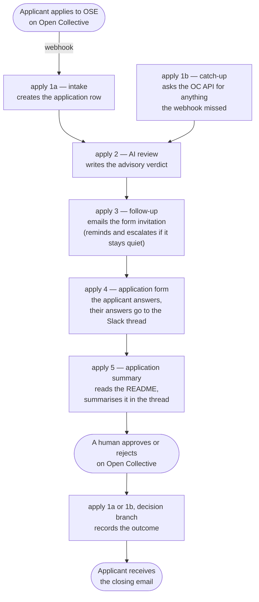

# Automation

Software that automates OSE community operations, starting with the new
collective application process.

Everything under `automation/` is licensed under the [MIT License](LICENSE).
The rest of this repository is covered by CC-BY-4.0.

## Human decisions

The AI review is advisory. It never approves, rejects or closes an
application. Approve and reject happen on Open Collective, by a person, and
the automation only listens for the result. The org
[AI policy](https://github.com/opensourceeurope/.github/blob/main/AI-POLICY.md)
lists "casting governance votes or approvals" as human-only.

Two reads go to the model, and they see different things.

The intake review sees public project material only: the collective's
description, the application message, and the linked repository and website.

The summary that runs after the form sees more, because a thin Open
Collective page is the problem it exists to solve. It sees the applicant's
form answers and the project's README.

Neither read is given the applicant's name or email address. The pipeline
stores both on the row, and no render step reads either column, so sending
one takes a deliberate edit rather than an oversight.

That is a promise about the columns, not about every character an applicant
types. The form has free text boxes, and a README is whatever its authors
wrote, so an applicant who signs a comment with their name and address has
sent them. Anyone assessing what this pipeline discloses should read that
sentence as the real boundary.

## Running it

The deployment lives on one VPS: n8n on Postgres behind Caddy.
[`infra/README.md`](infra/README.md) is the operator runbook. It covers
installation from a fresh box, SSH recovery, backups, restore, upgrades, and
a troubleshooting table of failures already hit in practice.

A merge to `main` reaches that instance on its own. The box pulls the commit
every 10 minutes and syncs the exports in `automation/n8n/` into the running
n8n, updating each workflow in place and leaving its active state alone. See
[Deploying the workflows on merge](infra/README.md#deploying-the-workflows-on-merge).

## The workflows

`automation/n8n/` holds the export of every workflow. Six workflows
coordinate through one Data table (`ose_applications`, keyed by collective
slug). The row is the record: a workflow reads state from it and writes state
back, rather than handing work to another workflow and trusting it to arrive.
A workflow does start the next one directly, four times over, but the call
carries no data and the caller never waits for it. It only saves the
application a wait for the next tick, and every stage keeps its own schedule
to recover a call that is lost. Each workflow sends its own emails and Slack
messages, and every applicant-facing email checks `DRY_RUN` first.

The automation serves Open Source Europe only. Open Collective Europe appears
in one place: the AI review may suggest that a project fits OCE better.

What OSE hosts is read broadly, and the review is written to match. Software
projects, and equally the communities, meetups, conferences, events, archives
and educational work that grow open source and the people doing it. A group
that maintains no repository of its own belongs here just as much as a library
does, which is why the form asks what kind of applicant someone is rather than
assuming a codebase. The review may only suggest OCE when the work has no
connection to open source at all, and it is told to answer `unclear` rather
than redirect whenever it is weighing the two.

On the instance the workflows are named `apply <step>` plus a description, so
the workflow list reads in pipeline order. The export files use short names.

| Workflow on the instance | Export | Trigger | What it does |
|---|---|---|---|
| `apply 1a — intake` | `oc-events-intake.json` | `POST /webhook/oc-events` | Treats every OC webhook as a ping, because the payload carries no application data. A new application gets a row. An approve or reject decision gets recorded, and the applicant gets the closing email. |
| `apply 1b — catch-up` | `intake-sweep.json` | `SWEEP_CRON` | Fetches applications and decisions the webhook missed. |
| `apply 2 — AI review` | `review.json` | A direct call from apply 1a or 1b, and `SWEEP_CRON` as the catch-up | Writes an advisory verdict on every row at stage `applied`. |
| `apply 3 — follow-up` | `followup.json` | A direct call from apply 2 for the invitation, and `SWEEP_CRON` for all three branches | Sends the form invitation for every reviewed row. The verdict picks the email. Also sends the one reminder and the Slack escalation, both derived from timestamps. |
| `apply 4 — application form` | `form-ose.json` | `/form/apply-ose` | The step 2 form, five pages. Page 1 checks the state table and asks what the applicant is, which decides whether page 2 asks about a repository or about a community. Page 3 asks whether the project is already a legal entity, which decides whether page 4 opens by asking what kind and where. Answers persist after every page, and a submission puts them in the application's Slack thread. |
| `apply 5 — application summary` | `summary.json` | A direct call from apply 4, and `SUMMARY_CRON` as the catch-up | Reads a submitted form and the project's README, then posts a description and the gaps a reviewer should ask about into the thread. Advisory, like the review: it never recommends a decision. |

One application flows through the workflows in this order:



An application moves through in one pass. Whichever intake creates the row
starts the AI review as soon as the row has its Slack thread anchor, the
review starts the follow-up as soon as it has written the verdict, and the
invitation is sent in that same run. An application no longer waits a morning
per stage.

The schedules are what make that safe rather than fragile. Every stage keeps
the cron it always had and still selects the rows its own stage owns, so a
hand-off that never lands costs one sweep interval and nothing more. No stage
waits for the stage it started, and a hand-off that fails is not an error for
the caller.

Sweeps landing together is also why every stage claims its row before working
it. Three schedules on one cron means three runs over the same rows at the
same moment, which is how one application got two summaries in its thread. A
stage now stamps its claim column with a conditional update that only one run
can win, and the runs that lose skip the row in silence. See "The three claim
columns" in [`docs/data-tables.md`](docs/data-tables.md).

`apply 1b — catch-up` exists because Open Collective delivers each
webhook event only once. If the server is unreachable at that moment, the
event is lost and the application would never enter the pipeline. The
catch-up asks the Open Collective API once a day for pending applications
and fresh decisions, and processes anything the webhook missed. A lost
event then means the applicant hears from us up to a day later, not never.

## Checking the exports

[`scripts/check-workflows.py`](scripts/check-workflows.py) reads the exports in
`automation/n8n/` and enforces six of the invariants in `AGENTS.md`. Each one
exists because that defect reached main at least once, and there are only six
on purpose. A check that flags style rather than breakage gets switched off,
and takes the real ones with it.

1. **No disabled nodes.** An export taken while nodes were switched off for a
   test is not the record of truth.
2. **No truncated expressions.** n8n ends a `{{ }}` expression at the first
   `}}`, so a nested object literal has to space its closing braces as `} }`.
   Inside a `{{ }}` segment, more `{` than `}` means the rest of the
   expression was swallowed. `validate_workflow` does not catch this.
3. **Every applicant-facing email is gated.** The node feeding each email send
   must be a Code node that reads `DRY_RUN`.
4. **Form answers reach the reviewer.** Every key of the `responses` object
   built by `Record submission` must appear in the label list of
   `Render submission thread reply` and of `Render summary request`. A key
   missing from a label list is dropped in silence, so an answer the applicant
   gave never reaches the people deciding.
5. **The data table is referenced the same way everywhere.** Every data table
   node points at `ose_applications` in name mode.
6. **Every workflow pins its timezone.** A workflow with no timezone in its
   settings inherits `GENERIC_TIMEZONE` and drifts away from the others when
   that changes.

Run it from the repository root. It needs no arguments, no dependencies, no
network and no API key, and it never touches the live instance.

```bash
python3 automation/scripts/check-workflows.py
```

It prints one line per problem, naming the export, the node and what is wrong,
and exits non-zero if anything failed. `--help` lists the checks. Pass a path
to check a single export or a directory of them.

[`.github/workflows/check-workflows.yml`](../.github/workflows/check-workflows.yml)
runs the same command on every pull request and on pushes to main, so refresh
the exports with `scripts/export-workflows.py` in the same pull request as any
workflow change.

## Configuration

[`.env.example`](.env.example) documents every variable, with its production
default and the value to use while testing. Copy it to `.env`, fill it in,
and keep it gitignored. The repository `.gitignore` already excludes `.env`.

SMTP, Slack and Open Collective credentials are deliberately not in there.
They live in n8n's own credential store, referenced by name from the nodes,
so they are never in a file and never in git. The runbook covers generating
and storing
[the Open Collective token](infra/README.md#the-open-collective-host-admin-credential),
[the Slack bot token](infra/README.md#the-slack-credential) and
[the SMTP relay](infra/README.md#the-smtp-credential).

### Providing the n8n API key to Claude Code

The repository enables the `n8n-skills` Claude Code plugin. Its MCP server
configuration passes `N8N_API_URL` and `N8N_API_KEY` to the n8n MCP server
as `${N8N_API_URL}` and `${N8N_API_KEY}`, and Claude Code expands those from
the environment of its own process when it launches the server. Without
them the server still starts and offers the read-only node and documentation
tools, but not the `n8n_*` workflow management tools.

**An `env` block in a settings file does not work for this.** Values from
`.claude/settings.local.json` reach the Bash tool and hooks, but not the
launch of the MCP server, which then receives the literal text
`${N8N_API_URL}`, fails its URL check, and hides the management tools. This
was verified by reading the environment of the running server process.

What works is exporting both variables in the shell Claude Code starts from.
Keep the key itself in a mode-600 file and read it from there:

```bash
# once: create the empty file with the right permissions (both commands are silent)
touch ~/.n8n-api-key && chmod 600 ~/.n8n-api-key
# paste the key from the n8n UI (Settings, n8n API) as one line, no quotes:
nano ~/.n8n-api-key
# check the length, not the content: expect the key length plus one for the newline
wc -c ~/.n8n-api-key
```

Then add two lines to `~/.zprofile`, the file every login shell reads on
macOS, so the shell startup file holds no secret:

```bash
printf '\nexport N8N_API_URL="https://automation.opensourceeurope.org"\nexport N8N_API_KEY="$(cat ~/.n8n-api-key 2>/dev/null)"\n' >> ~/.zprofile && tail -3 ~/.zprofile
```

The `tail` shows the two lines as written. They name the file, not the key.

Then quit and restart the client. The terminal `claude` picks the values up
from the shell it runs in. The VS Code extension gets them because VS Code
runs a login shell at startup to collect the environment, so VS Code itself
must be quit fully and reopened, not just the window.

Confirm by effect: in the new session, ask Claude Code to run the n8n
`n8n_health_check` tool. If it reports the tool does not exist, the
variables did not reach the server. `claude mcp list` in a terminal shows
the same thing as a `Missing environment variable` warning next to the
server.

The URL is the instance base URL, without `/api/v1`. The key grants create,
modify and execute on an instance that sends applicant email, so treat it
like the other secrets in this repository and revoke it in the n8n UI when
the workflows no longer need programmatic changes.

### Testing safely

`DRY_RUN` protects real applicants during any test, and it fails safe. Every
email node is fed by a render step that reads `DRY_RUN`, and applicant email is
suppressed unless the variable is explicitly and exactly `false`, after
trimming and lowercasing. A suppressed message goes to `DRY_RUN_RECIPIENT`
instead, with the intended recipient named in the subject, and the row is
marked `dry_run`. Unset, empty, `1`, `yes` and `true ` with a trailing space all
suppress, so a dropped or mistyped line in `.env` cannot quietly start mailing
real applicants. Going live is the deliberate act of writing `DRY_RUN=false`.

Slack is not redirected. Its messages are internal, they carry no applicant
address, and a rehearsal is only worth watching if the thread it produces is
the thread a reviewer would really see, so they post to `SLACK_CHANNEL` in a
dry run as well.

`DRY_RUN` is not a control on state. A test run still advances real rows, so
an application marked `form_invited` during a test never receives a real
invitation afterwards. Clear the timestamps of any row a test touched, or
delete the row.

One more thing about timers: they only fire when the sweep runs. A 5 minute
reminder threshold on an hourly sweep still takes an hour to fire. Shorten
`SWEEP_CRON` together with the thresholds, or click Execute on the sweep
workflow in the n8n UI.

## Checking the pull request description

[`.github/scripts/check-pr-body.py`](../.github/scripts/check-pr-body.py) fails a
pull request whose description is missing or over 350 prose words. It runs on
edit as well as open, so trimming clears it without pushing again.

It counts prose only. Fenced code blocks, tables, headings, URLs and the AI
disclosure line are all excluded, so putting detail into a table or a code block
costs nothing and is the intended way to keep a long change readable. The limit
was calibrated against every description in this repository: it passes the ones
that were useful and fails the three that sprawled.

Run it locally with the body in a file:

```bash
python3 .github/scripts/check-pr-body.py my-description.md
```

## Email templates

Files in `automation/emails/` are plain text email templates, one file per
message. The first line is `Subject: ` followed by the subject. After a blank
line, the rest of the file is the body.

Subject and body support `{{ placeholder }}` interpolation. The available
placeholders are `collective_name`, `collective_url`, `org_name`, `form_url`
and `ai_applicant_message`. The last of those arrives already quoted, each line
prefixed with `> `, so an applicant can see where our words stop and the
automated read begins. See "Filling the email and prompt templates" in
[`docs/data-tables.md`](docs/data-tables.md) for where each value comes from.

Which invitation an applicant receives depends on the verdict, and the mapping
is not one template per verdict:

| Verdict | Template | Carries the AI note |
|---|---|---|
| `fits` | `step2-invite.md` | no |
| `wrong_host` | `advised-wrong-host.md` | yes |
| `not_open_source` | `advised-not-open-source.md` | yes |
| `unclear` | `advised-not-open-source.md` | yes |

`unclear` shares the not-open-source template because the useful advice is the
same, which is to show the evidence in the form. A `fits` verdict still
produces an `ai_applicant_message`, but nothing sends it: that template exists
to get the applicant to the form without a machine's opinion in the way.

These files are the source of truth. The workflow that sends each message
embeds it verbatim, so an edit here also means updating that workflow and its
export.
